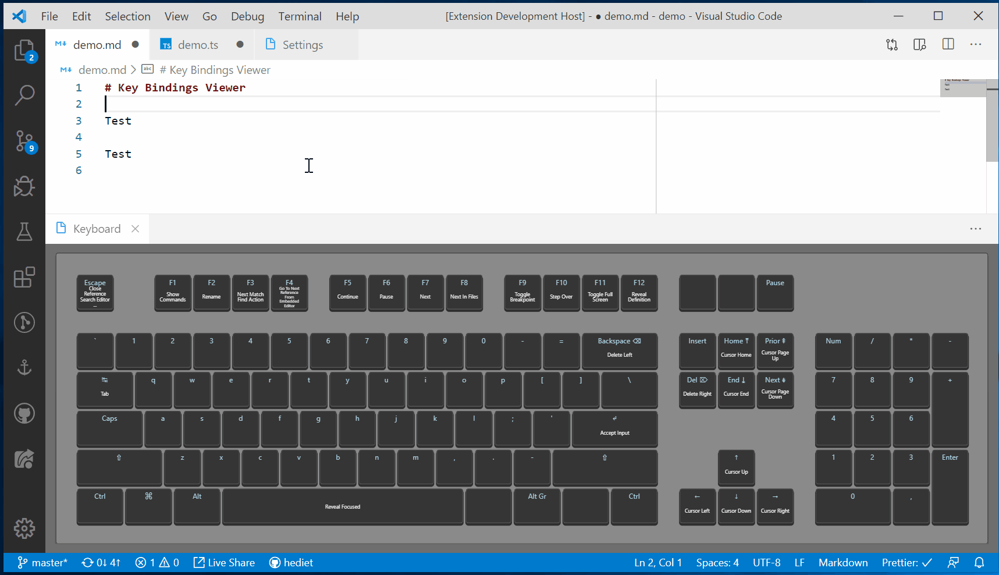

# Key Bindings Viewer

A VS Code extension for viewing key bindings.
You can play with the online version [here](https://hediet.github.io/visual-keyboard/).

## Usage

Install this extension and execute the command `Open Keyboard View`.

## Caveats

-   Does not consider contexts (`when` clause of a key binding), as there is no VS Code API for that.
-   Key Bindings are static and pre-bundled, as there is no VS Code API to retrieve all currently bound key bindings.
-   Supported (functional) keyboard layouts:
    -   US
    -   German
    -   German Neo 2
-   Supported physical layouts:
    -   ANSI
    -   ISO
-   Registers a global keyboard hook to listen for key events (even those triggered outside of VS Code),
    as VS Code does not expose key events with all required data.
    Uses a secured and local websocket connection to send those to the webview (but only if the VS Code window has focus).
    Please review the code if you have security concerns.
    No data leaves your computer.

## Settings

You can configure the physical and functional layout in VS Code's settings pane.

# Used Libraries

-   iohook is used to listen for key events
